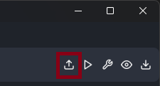
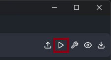
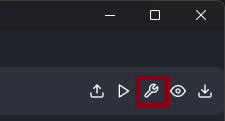
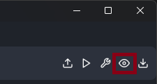
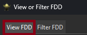
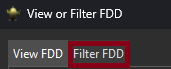
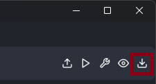
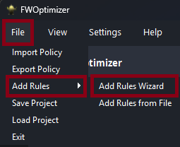
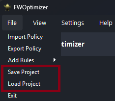

# FWOptimizer

**FWOptimizer** es una herramienta diseñada para optimizar conjuntos de reglas de firewall.

El proyecto utiliza el método **Firewall Decision Diagram (FDD)** para optimizar las reglas de firewall, mejorando la eficiencia y el rendimiento de las configuraciones de seguridad. También permite la visualización y filtrado del mismo con el objetivo de ganar entendimiento de su comportamiento.

## Características

* Optimización de reglas: Utiliza algoritmos sobre un FDD generado a partir de conjuntos de reglas para analizar y optimizar la política de firewall.

* Compatibilidad con IPTables: Actualmente, solo es compatible con firewalls que usen sintaxis de IPTables, pero se planea añadir soporte para otros tipos de firewalls en el futuro.

* Visualización de FDD: Permite generar y visualizar diagramas de decisión de firewall (FDD) para un análisis más claro de las reglas.

* Importación y exportación de reglas: Puedes importar reglas desde un archivo, optimizarlas y exportarlas a otro archivo.

* Add Rules Wizard: Facilita la adición de nuevas reglas a través de un asistente intuitivo.

* Filtrado de FDD: Permite filtrar el FDD para obtener una mejor visibilidad y análisis de condiciones específicas.

## Funciones

###  Importar reglas desde un archivo.

Haciendo click en la función "importar" es posible cargar un conjunto de reglas de firewall desde un archivo que contenga reglas con sintaxis de IPTables.



### Generar FDD.

Haciendo click en la función "Generar FDD" se generará la transformación de las reglas cargadas en el sistema a su equivalente FDD para una cadena seleccionada o para todas las cargadas en el sistema.



### Optimizar FDD.

Haciendo click en la función "Optimizar FDD" se aplicarán los algoritmos de optimización al FDD seleccionado o a todos los FDD en el sistema.



### Visualizar FDD

Haciendo click en la función "Visualizar FDD" se desplegará una ventana que permitirá visualizar los FDD 



#### Vista completa

Se puede generar una vista completa de el FDD seleccionado a través de la pestaña "View".



#### Vista filtrada

También se puede acceder a una vista filtrada de determinado FDD mediante el uso de la pestaña "Filter". Los filtros se aplican sobre los campos admitidos por el sistema.
Usar el campo de filtrado recursivamente sin limpiar los filtros previos permite generar un "stack" de filtros.



### Exportar reglas

Haciendo click en la función "Exportar Reglas" se realiza la conversión del FDD seleccionado a una lista de reglas con sintaxis de IPTables y se almacenan en el archivo seleccionado.



### Añadir reglas

Para añadir reglas puntuales a un FDD ya generado es posible utilizar la función "Add Rules Wizard". La ventana resultante permite el añadido de los predicados y la decisión de la regla.

**Importante**: El FDD deverá reoptimizarse luego de ser añadidas las reglas necesarias.



### Guardar y cargar proyecto

Mediante las funciones de "Guardado y Cargado", se pueden guardar y recuperar los cambios de un proyecto determinado.




## Requisitios

* [Python3](https://www.python.org/)

* [Graphviz](https://graphviz.org/)

## Instalación

1. Clonar el repositorio

    ```bash
        git clone https://github.com/generobruno/FWOptimizer.git
        cd FWOptimizer
    ```

2. Crear un entorno virtual (opcional pero recomendado):

    Esto asegurará que las dependencias del proyecto no interfieran con las de otros proyectos en tu sistema.

    ```bash
        python -m venv .venv_name

        # Linux
        > source .venv_name/bin/activate
        # Windows
        > .\.venv_name\Scripts\activate
    ```

3. Instalar las dependencias del proyecto

    ```bash
        pip install -e .
    ```

## Uso

Ejecutar el archivo principal del proyecto

```bash
    python ./fwoptimizer/main.py
```

## Tests

Para poder correr los test del proyecto se deberá además instalar algunas dependencias adicionales:

```bash
    pip install .[test]
```

